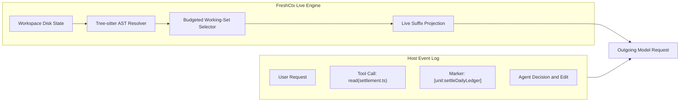

# Beyond append-only: building a live context engine for coding agents

*Source code is mutable state, not conversation history. What we learned from cutting context payloads by 76%, and the open problems it reveals.*

Felipe Basurto · September 6, 2026 · 9 min read

---

Imagine asking a colleague to debug a spreadsheet formula, but while they are working, you update the numbers behind their back. If they are working off a static screenshot, they can reason through every calculation with sound logic, but they will still give you the wrong answer.

Coding agents run into this problem constantly.

An agent reads `settlement.ts`. It plans its work. It edits the file, or a human edits it, or a linter changes formatting. That first read stays frozen in an append-only transcript. By turn six, the prompt often holds conflicting copies of the same file. In the worst cases, it holds an obsolete copy that no longer matches disk.

I built FreshCtx to fix this. It replaces stale reads in the prompt with stable markers and injects one current view of workspace code right before each model call.

On deterministic benchmarks, the numbers were clear. FreshCtx cut context payloads by 76.8% compared to whole-file synchronization. It kept 100% of required code symbols and injected zero stale bytes.

When we plugged it into live agents running real tasks, the picture changed.

The baseline agent without FreshCtx passed five out of five tasks.  
The agent with FreshCtx passed three out of five.

That outcome taught us something useful. Delivering updated code into a prompt is a solved systems problem. Getting an agent to use that code effectively is still wide open.

---

## 1. The architectural mismatch: event log vs. materialized view

When an agent needs to inspect a file, it calls a tool like `read_file`. The host program reads the disk, gets text, and appends that text to the conversation history. On every later turn, the host serializes that accumulated history and sends it back to the model.

This design treats code reads like conversation events: user asked this, agent ran that tool, tool returned this text.

That approach works for events, but source code is not conversation history. It is mutable state.

Treating code as history creates an architectural mismatch. In database terms, agent frameworks mistake an event log for a materialized view.

* An event log answers: what happened, in what order, and why?
* A materialized view answers: what is the state of the system right now?

Frameworks usually try to handle this through compaction, summarizing older turns or dropping tool outputs when the context window fills up. Compaction frees tokens, and an agent can always call read again if it suspects a change. Neither guarantees freshness. The prompt stays cluttered with point-in-time snapshots, spending tokens on outdated code.

---

## 2. Moving beyond whole files: the CORVUS baseline

The closest published research on this problem is the CORVUS paper by Mingwei Zheng and colleagues from July 2026.

CORVUS added a `sync_file` tool to the Strands Agents framework. Instead of leaving static file bodies in conversation history, registered files enter a synchronized set. Before each model call, the system refreshes that set and appends one current copy of each file after the conversation history.

The split makes sense: history records what happened, while the synchronized set reflects what exists now.

Testing four models on repository issues from SWE-bench Pro and SWE-PolyBench, the authors reported 9% to 50% fewer input tokens while keeping task success comparable.

CORVUS proved that live workspace synchronization works. But whole-file synchronization is coarse. If an agent inspects a fifteen-line helper inside a three-thousand-line file, whole-file synchronization resends all three thousand lines on every turn.

With FreshCtx, I wanted to synchronize specific symbols instead of whole files.

---

## 3. FreshCtx architecture: AST symbols, not files

FreshCtx runs as a small Node daemon with no external dependencies. It speaks a JSONL protocol named `freshctx/1` to host programs like Pi, Hermes, and OpenHands.

Instead of tracking files, FreshCtx uses Tree-sitter parsers to track structural code units: functions, classes, and enclosing syntax blocks.

If an edit adds forty lines above a function, Tree-sitter tracks the symbol itself instead of guessing from shifted line numbers. If a file has syntax errors during an edit, FreshCtx fails closed. It emits an explicit unavailable marker rather than guessing or copying broken code into neighboring functions.

Before each model request, the engine runs four steps:

**Mask historical reads.** Tool results in the request copy are replaced with stable markers like `[unit_id]`. This removes duplicate bodies from the prompt without altering the saved session on disk.

**Synchronize against disk.** The engine resolves tracked symbols against the current workspace files.

**Select by budget.** An online policy picks active units under a byte budget, prioritizing recent and relevant symbols.

**Project current code.** A single block containing current code appends to the request.

If anything in the bridge fails, it fails open. The host immediately sends its original, untouched request.

---

## 4. Systems validation: cutting payload bytes by 76.8%

To evaluate the transformation without model noise, I built CtxBench. It is a local runner that replays fixed traces on pinned commits from Flask, Express, go-tools, and ripgrep.

The numbers were clean:

* On the sealed `holdout-v0.3-apex` suite, the whole-file baseline produced 36,701 bytes. FreshCtx produced 8,504 bytes, a 76.8% reduction.
* Recall reached 100% for required code symbols.
* Injected stale bytes remained at zero.
* In a loopback test with OpenHands where a value changed from 10 to 20, standard requests sent the stale 10. FreshCtx sent the updated 20.

The mechanics worked. The outgoing context was smaller, current, and verifiable.

Then we tested it with a live model.

---

## 5. The live agent experiment

We connected FreshCtx to the Pi coding agent using DeepSeek V4 Flash across five multi-turn tasks.

The test compared two conditions:

* The baseline: plain Pi, standard tool reads, append-only history.
* FreshCtx: Pi with the FreshCtx extension refreshing the request before each model call.

Both setups could use file tools and read files again. Each run had an eight-request limit and allowed two answer submissions.

The first turn confirmed the systems behavior. Across all five tasks, FreshCtx delivered current disk bytes on the first request without requiring the agent to spend a turn re-reading.

The task outcomes showed a different pattern:

| Metric | Baseline (Plain Pi) | FreshCtx (Live Suffix) |
| :--- | :---: | :---: |
| Tasks solved | 5 / 5 | 3 / 5 |
| Request efficiency | Solved early | Hit limit on 2 tasks |
| Turn 1 code freshness | Stale until re-read | Exact current bytes |

The baseline solved all five tasks. FreshCtx solved three, but timed out on two.

Why did an agent with smaller, more accurate context stumble where an agent with stale history succeeded?

---

## 6. What the experiment taught us about model behavior

The session traces showed that the issue was not code freshness. The model did not act the way a systems designer expects. Three dynamics stood out:

### 1. Re-reading is an effective habit
Modern models train on thousands of hours of append-only agent traces. Their default response to uncertainty is simple: run the read tool.

When the baseline agent had stale code, it re-read the file. That costs an extra roundtrip and uses tokens, but it has an advantage. The fresh code arrives in the exact tool-result format the model expects, directly following its own action.

### 2. Models do not expect ambient updates
When FreshCtx injected the updated function into the prompt suffix, the agent often called `read_file` anyway. System prompts and reinforcement learning train models to verify code with tools before making changes.

The model did not expect the prompt to update on its own, so it did not look at the suffix to skip a tool call. We cut payload bytes, but the model did not take advantage of the shortcut.

### 3. Output formats can break on new prompt layouts
Task four showed how easily prompt changes can disrupt output.

The task required computing a number from updated code. The correct answer was 80.

The baseline agent re-read the file, calculated 80, returned pure JSON, and passed on request two.

The FreshCtx agent also calculated 80, and it had the updated code on turn one. Because FreshCtx appended a projection block at the end of the prompt, the model changed how it responded. Instead of returning raw JSON, it wrote a conversational explanation followed by the JSON block.

The automated checker required pure JSON. It rejected the submission. By the time the FreshCtx agent adapted and tried again, it had exhausted its request limit.

The model did not fail at reasoning or reading code. It failed an exact formatting check because the prompt structure shifted.

---

## 7. What context research needs next

It is tempting to look at a 5/5 versus 3/5 score and assume context synchronization is not worth doing. That misses the real takeaway.

Context management cannot be solved purely at the plumbing layer.

Agent tools, system prompts, and memory architectures have spent three years optimizing for append-only conversations. Models now expect a world where state only updates when they explicitly ask for it.

If we want agents that run across large codebases for days at a time, append-only logs are unsustainable. We cannot keep piling duplicate file reads into history and expecting summarizers to clean up the mess.

Live context synchronization is the right direction, but it leaves clear questions for researchers:

1. **Native co-design.** How can we prompt or train models to recognize that ambient code is authoritative, avoiding redundant tool calls?
2. **Projection placement.** Does appending code at the end of the prompt distract models from instructions, or should fresh code replace the original read inline?
3. **Cache-friendly ordering.** How should we order synchronized units so volatile functions do not invalidate prompt caches for stable parts of the repository?
4. **Multi-agent coordination.** When Agent A changes code that Agent B read ten turns ago, live synchronization is not an optional optimization. It is the only way to prevent them from overwriting each other.

---

## 8. Where we go from here

FreshCtx demonstrated that AST symbol synchronization can remove stale code and reduce context payloads by over 75% on real repositories without human intervention.

The next challenge is matching that engine with model habits.

The code, evaluation tools, and adapters are being developed in the open. If you study agent architectures, context management, or benchmarks, here are areas where we can collaborate:

* Testing alternative layouts, including inlining fresh code into original read slots.
* Evaluating live synchronization on multi-agent benchmarks where manual re-reading fails.
* Measuring whether small prompt adjustments help models trust and use ambient context.

Source code is mutable state. Our agent architectures should treat it that way.

---

*If you are working on coding agents, context management, or evaluations, I would like to hear your thoughts: [hello@felipebasurto.com](mailto:hello@felipebasurto.com).*

---

### Sources and research lineage

* **CORVUS**: *Context Optimization and Reduction Via Underlying Synchronization for LLM Coding Agents* (Zheng et al., July 2026; arXiv:2607.22711).
* **CodeStruct**: *Code Agents over Structured Action Spaces* (arXiv:2604.05407).
* **The Complexity Trap**: *Simple Observation Masking Is as Efficient as LLM Summarization* (arXiv:2508.21433).
* **Don't Break the Cache**: *An Evaluation of Prompt Caching for Long-Horizon Agentic Tasks* (arXiv:2601.06007).
* **FreshCtx research artifacts**: CtxBench deterministic evaluation suites, holdout-v0.3-apex results, and Pi RPC test batteries.
